# Open-NueChat

**An open-source, full-featured LLM chat platform** with Dynamic Tools, Assistant Modes, composable Filter Chains, Custom GPTs, Knowledge Bases (RAG), OAuth2 authentication, billing/token tracking, bidirectional WebSocket streaming, voice features (TTS/STT), image generation, and conversation branching.

[](LICENSE)

---

## ⚡ Quick Start

```bash
# 1. Clone and configure
git clone https://github.com/yourname/open-nuechat.git
cd open-nuechat
cp .env.example .env

# 2. Edit .env with your settings (minimum required):
#    - SECRET_KEY (generate with: openssl rand -hex 32)
#    - ADMIN_EMAIL / ADMIN_PASS
#    - LLM_API_BASE_URL (e.g., http://localhost:11434/v1 for Ollama)

# 3. Build and start (choose your platform)
./control.sh build --profile cpu     # or: rocm, cuda
./control.sh start -d --profile cpu

# 4. Open http://localhost:8000
```

> **GPU Users**: For ROCm, run `./control.sh faiss-build --profile rocm` first (~12 min build).

---

## 🏗️ Architecture (NC-0.8.0.x)

```mermaid
flowchart TB
    %% ===== External LLMs =====
    subgraph EXT[LLM Backend - External]
        Ollama[Ollama]
        vLLM[vLLM]
        OpenAI[OpenAI-Compatible]
    end

    %% ===== Frontend =====
    subgraph FE[React Frontend]
        UI[Chat UI<br/>• Voice Mode<br/>• Artifacts<br/>• Version Trees]
        Toolbar[Active Tools Bar<br/>• Dynamic Icons<br/>• Mode Toggle]
        FlowEdit[Filter Chain Editor<br/>• Visual Node Graph<br/>• Resizable Panels]
        Admin[Admin Panel<br/>• Assistant Modes<br/>• Branding]
    end

    %% ===== Backend Core =====
    subgraph CORE[FastAPI Backend]
        API[REST + WebSocket]
        Auth[Auth Service<br/>JWT / OAuth]
        LLM[LLM Service<br/>• Streaming<br/>• History Compression<br/>• Tool Calls]
    end

    %% ===== Filter Chain System (NC-0.8.0.0) =====
    subgraph FILTERS[Composable Filter Chains]
        direction TB
        Executor[Chain Executor<br/>• Flow Control<br/>• Variables<br/>• Conditionals]
        
        subgraph PRIMS[Primitives]
            RAG_P[RAG Nodes<br/>• local_rag<br/>• kb_rag<br/>• global_kb<br/>• user_chats_kb]
            DYN_P[Dynamic Nodes<br/>• export_tool<br/>• user_hint<br/>• user_action<br/>• set_title]
            FLOW_P[Flow Nodes<br/>• branch<br/>• call_chain<br/>• go_to_llm]
        end
    end

    %% ===== Assistant Modes =====
    subgraph MODES[Assistant Modes]
        General[General<br/>web_search, artifacts]
        Creative[Creative Writing<br/>no tools]
        Coding[Coding<br/>artifacts, file_ops]
        Research[Deep Research<br/>web_search, citations]
        Custom[Custom Mode<br/>user-defined]
    end

    %% ===== Storage =====
    subgraph STORE[Storage Layer]
        SQLite[(SQLite<br/>Users, Chats, Modes)]
        FAISS[(FAISS Vectors<br/>GPU Accelerated)]
        Files[File Storage<br/>Documents, Images]
    end

    %% ===== Optional Microservices =====
    subgraph MS[Optional Services]
        TTS[TTS - Kokoro]
        STT[STT - Whisper]
        IMG[Image Gen]
    end

    %% ===== Connections =====
    FE <--> |WebSocket / REST| API
    API --> Auth
    API --> LLM
    EXT --> API

    LLM --> Executor
    Executor --> PRIMS
    
    MODES --> Executor
    
    RAG_P --> FAISS
    RAG_P --> SQLite
    
    DYN_P --> LLM
    FLOW_P --> LLM

    TTS --> API
    STT --> API
    IMG --> API

    API --> STORE
```



---

## 🆕 What's New in NC-0.8.0.x (Major Refactor)

### Breaking Changes from 0.6.x / 0.7.x

NC-0.8.0.0 introduces a **major architectural shift** making RAG and tools **composable via filter chains** instead of hardcoded behaviors.

| Before (0.6/0.7) | After (0.8.0.x) |
|------------------|-----------------|
| Hardcoded RAG in websocket.py | `local_rag`, `kb_rag`, `global_kb`, `user_chats_kb` primitives |
| Fixed tool availability | **Assistant Modes** with configurable tool sets |
| No visual tool indicators | **Active Tools Bar** with dynamic icons |
| Static user interactions | **User Hints** (text selection) + **User Actions** (buttons) |
| No LLM-triggered tools | **Export Tool** pattern matching in LLM output |

### New Features

#### 🎛️ Assistant Modes
Admin-defined presets controlling which tools are active:

| Mode | Active Tools | Use Case |
|------|--------------|----------|
| General | web_search, artifacts | Everyday tasks |
| Creative Writing | (none) | Focused writing without distractions |
| Coding | artifacts, file_ops, code_exec | Development work |
| Deep Research | web_search, citations, kb_search | Research & analysis |

- Users can toggle individual tools (becomes "Custom" mode)
- Modes attach to Custom GPTs via "Assistant Style" dropdown

#### 🔧 Dynamic Tool Primitives

| Node Type | Trigger | Example |
|-----------|---------|---------|
| `user_hint` | Text selection popup | "🔍 Search Web", "💡 Explain" |
| `user_action` | Button below messages | "📎 Cite Sources", "🔄 Retry with Web" |
| `export_tool` | LLM pattern match | `$WebSearch="query"` in output |
| `set_title` | Filter chain action | Auto-title chats based on content |

#### 📊 RAG Evaluator Primitives

| Primitive | Description |
|-----------|-------------|
| `local_rag` | Search documents uploaded to current chat |
| `kb_rag` | Search current assistant's knowledge base |
| `global_kb` | Always-active global knowledge (invisible guardrails) |
| `user_chats_kb` | Search user's indexed chat history |

#### 🎨 UI Enhancements (NC-0.8.0.1)
- **Anti-aliasing**: Global font smoothing, SVG/icon rendering optimization
- **Resizable Panels**: Drag to resize node palette and config panel
- **Mobile Responsive**: Collapsible sidebars, touch-friendly controls
- **MiniMap**: Overview navigation for complex filter chains
- **Node Search**: Quick-find nodes in the palette

---

## ✨ Features

| Category | Features |
|----------|----------|
| 🎛️ **Assistant Modes** | Configurable tool presets, user toggles, Custom GPT integration |
| 🔗 **Filter Chains** | Visual node editor, 20+ primitives, branching logic, variables |
| 🤖 **Custom GPTs** | Create AI assistants with custom prompts, attach knowledge bases, marketplace |
| 📚 **Knowledge Bases** | RAG with local embeddings, FAISS GPU search, 50+ file types |
| 💬 **Real-time Chat** | WebSocket streaming, branching, retry/regenerate, zip uploads |
| 🎙️ **Voice** | TTS (Kokoro), STT (Whisper), hands-free mode |
| 🖼️ **Image Gen** | Integrated diffusion model, queue-based generation |
| 🔐 **Auth** | JWT, OAuth2 (Google/GitHub), API keys with scopes |
| 🔧 **Tools** | Calculator, web search, Python exec, document search, MCP |
| 💰 **Billing** | Token tracking, tier limits, admin bypass |

---

## 📖 Documentation

| Document | Description |
|----------|-------------|
| [USAGE.md](USAGE.md) | User guide - features, workflows, tips |
| [Notes.md](Notes.md) | Development notes, architecture details |
| [Signatures.md](Signatures.md) | API signatures and type definitions |
| [.env.example](.env.example) | All configuration options |
| `/docs` (runtime) | Interactive API documentation (Swagger) |

---

## 🔗 Filter Chain System

The heart of NC-0.8.0.x is the **composable filter chain system**. Instead of hardcoding behaviors, admins create visual workflows that process user queries and LLM responses.

### Available Node Types

| Category | Nodes |
|----------|-------|
| **AI** | `to_llm` (Ask AI), `query` (Generate Query) |
| **Tools** | `to_tool` (Run Tool) |
| **Flow** | `keyword_check`, `go_to_llm`, `filter_complete`, `stop`, `block` |
| **Data** | `set_var`, `set_array`, `context_insert`, `modify` |
| **Logic** | `compare`, `branch`, `call_chain` |
| **RAG** | `local_rag`, `kb_rag`, `global_kb`, `user_chats_kb` |
| **Dynamic** | `export_tool`, `user_hint`, `user_action` |
| **Chat** | `set_title` |

### Example: Web Search Chain

```
Start → Keyword Check ("search", "find", "lookup")
         ↓ (matched)
      Generate Query → Web Search Tool → Add to Context → Send to LLM
         ↓ (no match)
      Pass through to LLM directly
```

---

## Prerequisites

- **Docker** and **Docker Compose**
- **GPU Acceleration** (optional):
  - AMD: ROCm 6.0+ drivers
  - NVIDIA: CUDA 12.0+ and nvidia-container-toolkit

---

## Tech Stack

| Layer | Technology |
|-------|------------|
| **Backend** | FastAPI, SQLAlchemy (async), SQLite |
| **Frontend** | React 19, TypeScript, Tailwind CSS, Zustand, ReactFlow |
| **LLM** | OpenAI-compatible API (Ollama, vLLM, LM Studio, etc.) |
| **Embeddings** | sentence-transformers (local) |
| **Vector Search** | FAISS (GPU: ROCm/CUDA, or CPU) |
| **TTS** | Kokoro |
| **STT** | OpenAI Whisper |
| **Image Gen** | Diffusers (Z-Image-Turbo) |

---

## Installation

### For AMD GPUs (ROCm)

```bash
# Build FAISS wheel (one-time, ~12 minutes)
./control.sh faiss-build --profile rocm

# Build and start
./control.sh build --profile rocm
./control.sh start -d --profile rocm
```

### For NVIDIA GPUs (CUDA)

```bash
./control.sh build --profile cuda
./control.sh start -d --profile cuda
```

### For CPU Only

```bash
./control.sh build --profile cpu
./control.sh start -d --profile cpu
```

---

## Configuration

### Required Environment Variables

```bash
# .env file - minimum required
SECRET_KEY=your-secure-random-string-here
ADMIN_EMAIL=admin@example.com
ADMIN_PASS=your-admin-password

# LLM Configuration
LLM_API_BASE_URL=http://localhost:11434/v1  # Ollama
LLM_MODEL=llama3.2
```

### Optional Environment Variables

```bash
# Branding
APP_NAME=Open-NueChat
APP_TAGLINE=AI-Powered Chat Platform
DEFAULT_THEME=dark

# OAuth
GOOGLE_CLIENT_ID=
GOOGLE_CLIENT_SECRET=
GITHUB_CLIENT_ID=
GITHUB_CLIENT_SECRET=

# Features
ENABLE_REGISTRATION=true
ENABLE_BILLING=true
FREEFORALL=false

# GPU
FAISS_USE_GPU=true
```

See `.env.example` for all available options.

---

## Project Structure

```
open-nuechat/
├── backend/
│   ├── app/
│   │   ├── api/routes/       # FastAPI endpoints
│   │   │   ├── assistant_modes.py  # NC-0.8.0.0
│   │   │   └── filter_chains.py
│   │   ├── services/         # Business logic
│   │   ├── filters/          # Filter chain system
│   │   │   ├── executor.py   # Chain execution engine
│   │   │   ├── manager.py    # Chain CRUD & caching
│   │   │   └── parts.py      # Built-in primitives
│   │   ├── tools/            # Built-in tools
│   │   └── models/
│   │       ├── assistant_mode.py  # NC-0.8.0.0
│   │       └── filter_chain.py
├── frontend/
│   ├── src/
│   │   ├── components/
│   │   │   ├── FlowEditor.tsx      # Visual chain editor
│   │   │   ├── ActiveToolsBar.tsx  # Tool toggle UI
│   │   │   └── TextSelectionBubble.tsx
│   │   ├── pages/
│   │   │   └── Admin.tsx           # Assistant Modes tab
│   │   └── stores/
├── tts-service/
├── image-service/
├── docker-compose.yml
├── control.sh
└── .env.example
```

---

## Control Script

```bash
# Lifecycle
./control.sh build --profile <cpu|rocm|cuda>
./control.sh start -d --profile <profile>
./control.sh stop
./control.sh restart
./control.sh status
./control.sh logs -f

# Services
./control.sh tts start|stop|status
./control.sh image start|stop|logs

# Database
./control.sh db migrate
./control.sh db seed
./control.sh db reset

# Cleanup
./control.sh clean [--all|--volumes|--images]
```

---

## API Endpoints

### Core
- `POST /api/auth/register` - Create account
- `POST /api/auth/login` - Sign in
- `WS /ws/ws?token={jwt}` - Real-time chat

### Assistant Modes (NC-0.8.0.0)
- `GET /api/assistant-modes` - List modes
- `POST /api/assistant-modes` - Create mode (admin)
- `PUT /api/assistant-modes/{id}` - Update mode (admin)
- `DELETE /api/assistant-modes/{id}` - Delete mode (admin)

### Filter Chains
- `GET /api/filter-chains` - List chains
- `POST /api/filter-chains` - Create chain (admin)
- `GET /api/filter-chains/schema` - Get node schema

### OpenAI-Compatible
- `GET /v1/models` - List models + Custom GPTs
- `POST /v1/chat/completions` - Chat with streaming
- `POST /v1/images/generations` - Image generation
- `POST /v1/embeddings` - Text embeddings

Full API documentation at `/docs` when running.

---

## Schema Version

**Current: NC-0.8.0.1**

### NC-0.8.0.1 Changes
- **Global Anti-aliasing**: Smooth text/icon rendering across all UI
- **Resizable Panels**: Drag-to-resize in FlowEditor
- **Mobile Responsive**: Collapsible sidebars, touch gestures
- **Set Title Node**: Filter chains can update chat titles
- **Node Search**: Quick-find in palette

### NC-0.8.0.0 Changes (Major Refactor)
- **Assistant Modes**: Configurable tool presets per chat/GPT
- **Dynamic Tools**: `export_tool`, `user_hint`, `user_action` primitives
- **RAG Primitives**: `local_rag`, `kb_rag`, `global_kb`, `user_chats_kb`
- **Active Tools Bar**: Visual tool status with toggles
- **ExecutionContext**: `from_llm`/`from_user` flags for bidirectional chains
- **Database**: New `assistant_modes` table, `mode_id`/`active_tools` on chats

### Migration from 0.7.x
The database schema automatically migrates on startup. However, any custom filter chains may need updates to use the new RAG primitives instead of hardcoded behaviors.

---

## License

**Apache License 2.0** with additional attribution requirements.

### Requirements
1. **Attribution**: Credit "Open-NueChat" in derivative works
2. **Citation**: For academic use, cite the project
3. **Visible Credit**: If deployed as a service, include credit in footer

See [LICENSE](LICENSE) for full terms.

---

## Contributing

Contributions welcome! Please:

1. Fork the repository
2. Create a feature branch
3. Make your changes
4. Submit a pull request

---

## Acknowledgments

Built with:
- [FastAPI](https://fastapi.tiangolo.com/) - Backend framework
- [React](https://react.dev/) - Frontend library
- [ReactFlow](https://reactflow.dev/) - Visual node editor
- [FAISS](https://github.com/facebookresearch/faiss) - Vector search
- [Kokoro](https://github.com/hexgrad/kokoro) - Text-to-speech
- [Whisper](https://github.com/openai/whisper) - Speech-to-text
- [sentence-transformers](https://www.sbert.net/) - Embeddings
